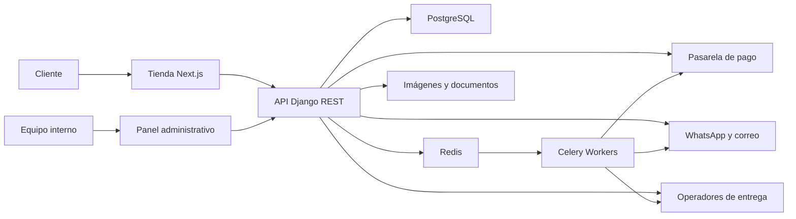

# Black Dog Store — Arquitectura recomendada para el ecommerce

**Versión:** 1.0  
**Fecha:** 19 de junio de 2026  
**Estado:** Propuesta previa al desarrollo

## 1. Recomendación ejecutiva

Black Dog Store debería construirse como una aplicación ecommerce propia, separada del sistema “Factura CRM” que actualmente ocupa este repositorio.

La recomendación principal es:

- **Frontend público:** Next.js + React + TypeScript.
- **Backend y panel administrativo:** Python + Django.
- **API:** Django REST Framework.
- **Base de datos:** PostgreSQL.
- **Procesos en segundo plano:** Celery + Redis.
- **Archivos e imágenes:** almacenamiento compatible con S3.
- **Contenedores:** Docker.
- **Monitoreo:** Sentry y registros estructurados.

Esta combinación aprovecha Python para la lógica del negocio y Django para la seguridad, permisos y administración, mientras Next.js ofrece una tienda rápida, indexable, moderna y visualmente cuidada.

No recomiendo construir toda la solución únicamente con Django Templates ni crear un backend de microservicios desde el inicio. La primera opción limita la experiencia de frontend; la segunda agrega complejidad innecesaria para la etapa actual del negocio.

## 2. Por qué Django

Django encaja especialmente bien porque Black Dog Store necesita mucho más que mostrar productos:

- Usuarios internos con permisos diferentes.
- Catálogo con variantes.
- Inventario por unidad.
- Registro de IMEI y número de serie.
- Equipos nuevos y seminuevos con datos distintos.
- Pedidos, pagos, entregas y devoluciones.
- Garantías.
- Servicio técnico.
- Auditoría de operaciones.
- Panel administrativo.
- Automatizaciones y notificaciones.

Django incluye una base sólida para autenticación, seguridad, sesiones, permisos, formularios y administración. También permite construir reglas de negocio complejas de manera ordenada.

### Versión recomendada

La línea base propuesta al 19 de junio de 2026 es **Python 3.13 + Django 5.2 LTS**. Antes de crear el proyecto se debe comprobar la compatibilidad de todas las dependencias, fijar versiones exactas y mantenerlas mediante actualizaciones controladas.

## 3. Por qué Next.js en el frontend

La tienda pública debe competir en presentación, velocidad y facilidad de compra. Next.js aporta:

- Renderizado optimizado para buscadores.
- Buen rendimiento en páginas de categorías y productos.
- Optimización de imágenes.
- Rutas dinámicas.
- Componentes React.
- Integración con analítica y contenido.
- Posibilidad de regenerar páginas sin desplegar toda la aplicación.
- Excelente experiencia móvil.

### Lenguajes

- **Python:** backend, reglas de negocio, tareas y automatizaciones.
- **TypeScript:** frontend.
- **SQL:** consultas y optimización de PostgreSQL.
- **HTML y CSS:** estructura y presentación.

La línea base del frontend será la versión estable vigente de Next.js con App Router al iniciar el repositorio. No se adoptarán versiones experimentales para el ecommerce.

Evitar JavaScript sin tipado en la aplicación principal. TypeScript reduce errores en precios, estados, variantes, respuestas de API y formularios.

## 4. Arquitectura general



### Enfoque recomendado

Un **monolito modular** en Django:

- Una aplicación desplegable.
- Módulos separados por dominio.
- Una base de datos principal.
- API claramente versionada.
- Tareas pesadas fuera del proceso web.

Este diseño es más fácil de desarrollar, probar y operar. Si el volumen crece, algunos módulos pueden separarse posteriormente sin rehacer el negocio completo.

## 5. Estructura de repositorio

Crear un repositorio exclusivo para Black Dog Store:

```text
black-dog-store/
├── apps/
│   ├── storefront/              # Next.js
│   └── backend/                 # Django
├── packages/
│   ├── api-client/              # Cliente TypeScript generado
│   ├── ui/                      # Sistema de diseño
│   └── config/                  # Configuración compartida
├── infrastructure/
│   ├── docker/
│   ├── nginx/
│   └── deployment/
├── docs/
├── .github/workflows/
├── docker-compose.yml
└── README.md
```

### Backend

```text
apps/backend/
├── config/
├── modules/
│   ├── accounts/
│   ├── catalog/
│   ├── inventory/
│   ├── pricing/
│   ├── carts/
│   ├── checkout/
│   ├── orders/
│   ├── payments/
│   ├── fulfillment/
│   ├── customers/
│   ├── warranties/
│   ├── trade_in/
│   ├── technical_service/
│   ├── promotions/
│   ├── content/
│   ├── notifications/
│   ├── analytics/
│   └── audit/
├── api/
│   └── v1/
├── tests/
└── manage.py
```

### Frontend

```text
apps/storefront/
├── app/
│   ├── (store)/
│   ├── cuenta/
│   ├── carrito/
│   ├── checkout/
│   └── api/
├── components/
│   ├── ui/
│   ├── catalog/
│   ├── checkout/
│   └── account/
├── features/
├── lib/
├── styles/
└── tests/
```

## 6. Sistemas y módulos

### Catálogo

- Categorías: iPhone, iPad, MacBook, AirPods y accesorios.
- Marcas de accesorios.
- Modelos.
- Capacidades.
- Colores.
- Condición: nuevo o seminuevo.
- Características.
- Compatibilidad.
- Galería.
- Videos.
- Productos relacionados.
- Accesorios recomendados.
- SEO por producto y categoría.
- Estado de publicación.

### Inventario

No todos los productos deben manejarse igual.

#### Equipos serializados

Cada iPhone, iPad, MacBook o AirPods puede requerir una unidad individual:

- SKU.
- IMEI.
- Número de serie.
- Lista blanca.
- Estado.
- Salud de batería.
- Ciclos de batería, cuando aplique.
- Condición estética.
- Piezas o intervenciones detectadas.
- Costo de adquisición.
- Precio de venta.
- Ubicación.
- Garantía.
- Estado de reserva.

El IMEI y el número de serie completos deben ser privados. En la web solo se muestra información parcial cuando sea necesario.

#### Accesorios

Se manejan por cantidad:

- SKU.
- Stock disponible.
- Stock reservado.
- Stock mínimo.
- Ubicación.
- Lote opcional.

### Precios

- Precio normal.
- Precio promocional.
- Fecha de inicio y fin.
- Costo interno.
- Margen.
- Historial de precios.
- Reglas por canal, solo si existe una razón comercial.
- Moneda PEN como principal.
- Precios en USD solo si el negocio define una política legal y operativa clara.

Todos los montos se almacenan como enteros en la unidad monetaria mínima o mediante un tipo decimal preciso. Nunca se usan números de punto flotante.

### Carrito

- Carrito para visitante.
- Carrito vinculado a la cuenta.
- Persistencia.
- Validación de precio y stock.
- Reserva temporal durante el pago.
- Eliminación automática de reservas vencidas.
- Recomendaciones de accesorios.

### Checkout

- Compra como invitado.
- Compra con cuenta.
- Dirección.
- Recojo en tienda.
- Delivery en Arequipa.
- Envío nacional.
- Cálculo de costos.
- Selección de comprobante.
- Validación final de inventario.
- Aceptación de políticas.
- Idempotencia para evitar pedidos duplicados.

No debe obligarse al cliente a crear una cuenta antes de comprar.

### Pagos

La solución debe usar una pasarela disponible en Perú y mantener una capa de integración propia para poder cambiar de proveedor.

Evaluar antes de contratar:

- Culqi.
- Mercado Pago.
- Niubiz.
- Izipay u otra alternativa vigente.

La decisión debe comparar:

- Comisión total.
- Plazo de abono.
- Contracargos.
- 3-D Secure.
- Tokenización.
- Yape u otros medios.
- Calidad de API y webhooks.
- Sandbox.
- Soporte.
- Reembolsos.
- Conciliación.

Reglas técnicas:

- Black Dog Store no almacena datos completos de tarjetas.
- El backend confirma el pago mediante webhook firmado.
- El frontend nunca marca un pedido como pagado por sí solo.
- Cada evento de pago es idempotente.
- Se registra historial de intentos y reembolsos.

### Pedidos

Estados sugeridos:

```text
DRAFT
PENDING_PAYMENT
PAYMENT_REVIEW
PAID
PREPARING
READY_FOR_PICKUP
SHIPPED
DELIVERED
CANCELLED
REFUND_PENDING
REFUNDED
```

Los estados de pago, preparación y entrega deben ser independientes internamente. Un único campo no representa bien todo el ciclo.

### Entregas

- Recojo en tienda.
- Delivery local.
- Pago contra entrega en Arequipa.
- Envío nacional.
- Dirección y referencias.
- Costo.
- Operador.
- Código de seguimiento.
- Evidencia de entrega.
- Incidencias.
- Notificaciones.

El pago contra entrega debe tener límites por zona, monto y tipo de producto para reducir pedidos falsos.

### Garantías y postventa

- Documento de garantía.
- Tipo de cobertura.
- Responsable: Apple o Black Dog Store.
- Fecha de inicio y fin.
- Serie vinculada.
- Reclamos.
- Diagnóstico.
- Evidencias.
- Resolución.
- Historial.

Para equipos nuevos debe registrarse la cobertura limitada de Apple y facilitar al cliente su validación. Para seminuevos debe registrarse la garantía de Black Dog Store.

### Servicio técnico

Conviene incluirlo en la misma plataforma administrativa, aunque no forme parte del checkout inicial:

- Orden de ingreso.
- Fotos.
- Equipo y serie.
- Problema reportado.
- Diagnóstico.
- Presupuesto.
- Aprobación del cliente.
- Repuestos.
- Técnico asignado.
- Estados.
- Garantía de reparación.
- Entrega.
- Historial de comunicación.

Estados sugeridos:

```text
RECEIVED
DIAGNOSING
WAITING_APPROVAL
WAITING_PART
IN_REPAIR
QUALITY_CHECK
READY
DELIVERED
CANCELLED
```

### Trade-in o parte de pago

No incluirlo en el primer lanzamiento hasta tener política operativa. Luego puede incorporar:

- Pre-evaluación.
- Fotos.
- Modelo y capacidad.
- IMEI parcial.
- Batería.
- Estado.
- Oferta preliminar.
- Evaluación presencial.
- Oferta final.
- Relación con el pedido nuevo.

### Promociones

- Cupones.
- Descuentos por producto o categoría.
- Promociones con vigencia.
- Regalos.
- Límites de uso.
- Monto mínimo.
- Auditoría.

No conviene construir un motor de promociones extremadamente genérico en la primera fase.

### Contenido

- Banners.
- Páginas institucionales.
- Preguntas frecuentes.
- Políticas.
- Guías.
- Blog.
- SEO.
- Historias o campañas.

Para la primera versión, el contenido puede administrarse desde Django. No es necesario contratar un CMS externo.

### Notificaciones

- Confirmación de pedido.
- Confirmación de pago.
- Pedido listo.
- Envío.
- Entrega.
- Carrito abandonado, con consentimiento.
- Estado del servicio técnico.
- Garantía próxima a vencer, si corresponde.

Canales:

- Correo.
- WhatsApp mediante proveedor oficial.
- Notificaciones internas.

## 7. Usuarios internos y permisos

No se deben implementar permisos con múltiples comprobaciones dispersas del tipo `if role == admin`. Usar permisos por capacidad y alcance.

### Roles recomendados

| Rol | Responsabilidad |
|---|---|
| Superadministrador | Configuración total, permisos y operaciones críticas |
| Administrador general | Operación comercial completa sin controlar seguridad raíz |
| Gerente de tienda | Pedidos, stock, precios autorizados y reportes |
| Ventas | Clientes, pedidos, reservas y cotizaciones |
| Almacén | Ingreso, ubicación, preparación y ajuste controlado de stock |
| Caja/finanzas | Pagos, conciliación, comprobantes, reembolsos autorizados |
| Servicio técnico | Órdenes técnicas, diagnóstico, repuestos y estados |
| Marketing/contenido | Productos publicados, banners, contenido y promociones aprobadas |
| Atención al cliente | Consultas, pedidos, entregas, cambios y garantías |
| Auditor | Acceso de solo lectura a operaciones e historial |
| Cliente | Cuenta, pedidos, direcciones, garantías y servicios propios |

### Acciones que requieren permiso especial

- Modificar costos.
- Modificar precios.
- Aplicar descuentos manuales.
- Ajustar inventario.
- Ver IMEI o series completas.
- Reembolsar.
- Cancelar pedidos pagados.
- Exportar clientes.
- Cambiar permisos.
- Eliminar contenido o productos.
- Ver reportes financieros.

### Controles

- Autenticación multifactor obligatoria para personal.
- Registro de inicio de sesión.
- Sesiones revocables.
- Límites de intentos.
- Auditoría de cambios.
- Acceso de mínimo privilegio.
- Aprobación adicional para reembolsos o descuentos de alto monto.

## 8. Panel administrativo

El panel debe tener dos niveles:

### Django Admin

Útil desde el primer día para:

- Configuración interna.
- Gestión de tablas maestras.
- Operaciones de soporte.
- Diagnóstico.

No debe ser la experiencia principal del equipo para los procesos frecuentes.

### Dashboard operativo personalizado

Debe construirse para:

- Resumen de ventas.
- Pedidos pendientes.
- Stock bajo.
- Reservas por vencer.
- Pagos por conciliar.
- Entregas.
- Garantías.
- Servicios técnicos.
- Productos más consultados.
- Alertas.

Cada rol verá únicamente los módulos, datos y acciones que necesita.

## 9. Modelo de datos central

Entidades principales:

```text
User
Role
Permission
Customer
Address
Category
Brand
Product
ProductVariant
SerializedUnit
AccessoryStock
ProductMedia
Price
Promotion
Cart
CartItem
Order
OrderItem
Payment
PaymentEvent
Refund
Shipment
DeliveryZone
Warranty
WarrantyClaim
ServiceOrder
ServicePart
InventoryMovement
StockReservation
Notification
AuditEvent
```

### Regla crítica

Un pedido debe conservar una copia histórica de:

- Nombre del producto.
- SKU.
- Condición.
- Precio.
- Descuento.
- Impuestos.
- Garantía ofrecida.
- Dirección.
- Costo y modalidad de entrega.

Nunca debe depender de los datos actuales del catálogo para reconstruir una compra pasada.

## 10. API

Usar REST en la primera versión.

REST es suficiente para:

- Catálogo.
- Cuenta.
- Carrito.
- Checkout.
- Pedidos.
- Administración.
- Integraciones.

GraphQL no aporta una ventaja proporcional en esta etapa.

Buenas prácticas:

- Rutas bajo `/api/v1`.
- Esquema OpenAPI.
- Cliente TypeScript generado.
- Paginación.
- Filtros.
- Errores consistentes.
- Validación en backend.
- Idempotency keys en checkout y pagos.
- Rate limiting.
- Webhooks firmados.

## 11. Seguridad

- HTTPS obligatorio.
- Cookies seguras y `HttpOnly` para sesiones web.
- Protección CSRF.
- Política estricta de CORS.
- Validación y normalización de entradas.
- Consultas parametrizadas mediante ORM.
- Content Security Policy.
- Cabeceras de seguridad.
- Gestión de secretos fuera del repositorio.
- Cifrado de respaldos.
- Redacción de datos sensibles en logs.
- Escaneo de dependencias.
- Backups automáticos y pruebas de restauración.
- Separación de desarrollo, pruebas y producción.
- Auditoría inmutable de operaciones críticas.

No almacenar:

- Datos completos de tarjeta.
- Contraseñas de Apple ID.
- Credenciales bancarias.
- Códigos innecesarios de desbloqueo.

## 12. Privacidad, comprobantes y operación en Perú

Antes de abrir ventas se debe validar con asesoría contable y legal:

- Tratamiento de datos personales.
- Política de privacidad.
- Términos y condiciones.
- Política de cambios y devoluciones.
- Libro de Reclamaciones virtual.
- Precios y condiciones claramente visibles.
- Emisión de boleta o factura.
- Integración con un proveedor de facturación electrónica o sistema aprobado.
- Conservación de comprobantes y documentos.
- Consentimiento para comunicaciones comerciales.

La facturación electrónica debe integrarse como un módulo separado del núcleo de pedidos. Un pedido pagado puede disparar la emisión, pero ambos sistemas deben conservar estados independientes.

## 13. Búsqueda y filtros

En la primera etapa, PostgreSQL puede resolver búsqueda y filtros:

- Modelo.
- Categoría.
- Capacidad.
- Color.
- Estado.
- Precio.
- Disponibilidad.

No recomiendo Elasticsearch o Algolia desde el inicio. Se pueden incorporar cuando el catálogo y las métricas demuestren la necesidad.

## 14. Analítica

### Negocio

- Ventas netas.
- Ticket promedio.
- Margen.
- Conversión.
- Abandono de carrito.
- Productos más vistos.
- Productos sin stock.
- Rotación.
- Tiempo de preparación.
- Efectividad de promociones.
- Reclamos y devoluciones.
- Rendimiento por canal.

### Producto digital

- Vista de producto.
- Búsqueda.
- Añadir al carrito.
- Inicio de checkout.
- Pago completado.
- Error de pago.
- Consulta por WhatsApp.

Recomendación:

- Google Analytics 4 para adquisición y comercio.
- Google Search Console para SEO.
- Una herramienta de analítica de producto o privacidad cuando se justifique.
- Sentry para errores y rendimiento técnico.

No deben enviarse IMEI, series, documentos o datos sensibles a herramientas de analítica.

## 15. Calidad

### Pruebas

- Unitarias para precios, inventario, permisos y estados.
- Integración para pagos, reservas y pedidos.
- API.
- End-to-end para compra, recojo y administración.
- Accesibilidad.
- Rendimiento.
- Seguridad.

### Herramientas sugeridas

- Pytest para backend.
- Playwright para flujos completos.
- Vitest para utilidades frontend.
- Ruff para lint y formato de Python.
- Mypy o Pyright para tipado progresivo.
- ESLint y TypeScript para frontend.

## 16. Infraestructura

### Desarrollo

Docker Compose:

- PostgreSQL.
- Redis.
- Backend.
- Celery worker.
- Frontend.
- Almacenamiento S3 local opcional.

### Producción inicial

Dos rutas razonables:

#### Opción administrada

- Frontend en Vercel.
- Backend y Celery en Render, Railway, Fly.io o proveedor equivalente.
- PostgreSQL administrado.
- Redis administrado.
- Archivos en S3, Cloudflare R2 o equivalente.

Ventaja: menos operación.  
Riesgo: costos repartidos y dependencia de varios proveedores.

#### Opción consolidada

- Servicios en una nube principal.
- Contenedores administrados.
- PostgreSQL, Redis y almacenamiento administrados.
- CDN.

Ventaja: mayor control y una arquitectura más uniforme.  
Riesgo: requiere más conocimiento de infraestructura.

La selección final debe comparar costos reales, región, latencia hacia Perú, soporte, backups y facilidad operativa.

## 17. Funciones que no recomiendo para el primer lanzamiento

- Aplicación móvil nativa.
- Microservicios.
- GraphQL.
- Marketplace con múltiples vendedores.
- Motor de recomendaciones con inteligencia artificial.
- Programa de puntos complejo.
- Múltiples almacenes si solo existe una tienda.
- Múltiples monedas con conversión automática.
- Chat propio.
- ERP propio.
- Integración automática de trade-in.

Estas funciones pueden añadirse después de validar ventas y operación.

## 18. Alcance recomendado por fases

### Fase 0 — Definición

- Políticas.
- Pasarela.
- Entregas.
- Comprobantes.
- Taxonomía del catálogo.
- Roles.
- Flujos.
- Diseño.
- Métricas.

### Fase 1 — Ecommerce operativo

- Catálogo.
- Búsqueda y filtros.
- Producto.
- Carrito.
- Checkout invitado.
- Pago.
- Recojo y delivery.
- Pedidos.
- Correos.
- Panel básico.
- Inventario.
- SEO.
- Analítica.

### Fase 2 — Operación avanzada

- Dashboard por roles.
- Envíos nacionales.
- Conciliación.
- Garantías.
- Cupones.
- WhatsApp.
- Reportes.
- Servicio técnico.

### Fase 3 — Crecimiento

- Trade-in.
- Automatización de marketing.
- Fidelización.
- Personalización.
- Integraciones contables.
- Funciones omnicanal.

## 19. Decisiones que deben cerrarse antes de programar

1. ¿Se venderá directamente en línea desde el lanzamiento o se reservará por WhatsApp?
2. ¿Qué pasarela se contratará?
3. ¿Se emitirá boleta o factura automáticamente?
4. ¿Qué proveedor realizará esa emisión?
5. ¿Cómo se calculan delivery y envío nacional?
6. ¿Qué stock se publicará en tiempo real?
7. ¿Cuánto dura una reserva?
8. ¿Qué datos públicos tendrá cada seminuevo?
9. ¿Qué política rige cambios, devoluciones y garantías?
10. ¿Qué roles existen realmente en el equipo inicial?
11. ¿Qué descuentos puede autorizar cada rol?
12. ¿Se aceptará compra como invitado? Recomendación: sí.
13. ¿Se ofrecerá pago contra entrega para todos los montos? Recomendación: no.
14. ¿El servicio técnico será visible y consultable desde la primera versión?
15. ¿Qué indicadores necesita revisar el propietario cada día?

## 20. Recomendación final

La pila tecnológica propuesta es:

| Capa | Tecnología |
|---|---|
| Frontend | Next.js, React, TypeScript |
| Estilos | Tailwind CSS y componentes propios |
| Backend | Python, Django |
| API | Django REST Framework |
| Base de datos | PostgreSQL |
| Cola y caché | Celery, Redis |
| Imágenes | S3/R2 y CDN |
| Autenticación | Sesiones seguras; MFA para personal |
| Documentación API | OpenAPI |
| Pruebas | Pytest, Playwright, Vitest |
| Infraestructura | Docker y servicios administrados |
| Monitoreo | Sentry, métricas y logs estructurados |

La clave no será acumular frameworks. Será modelar correctamente inventario serializado, pagos, garantías, permisos, auditoría y operación omnicanal. Esa base permitirá que la web se vea profesional y, sobre todo, que funcione como un negocio serio.
