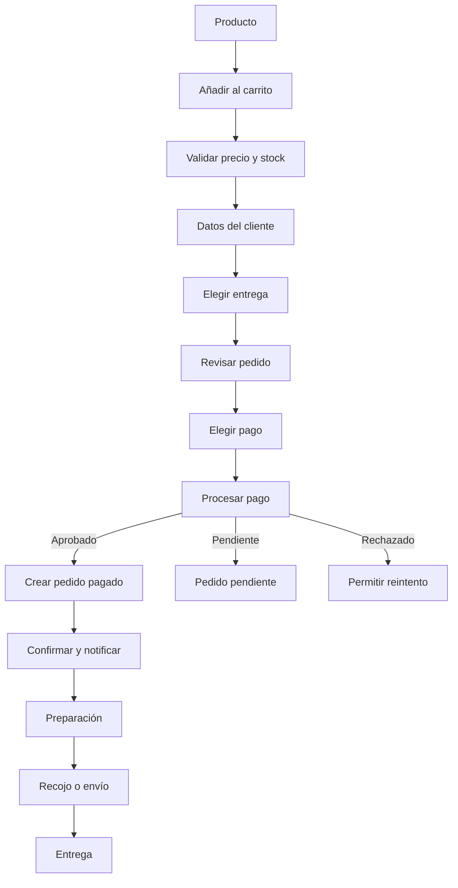

# Black Dog Store — Plan funcional previo al desarrollo

**Versión:** 1.0  
**Fecha:** 19 de junio de 2026  
**Objetivo:** definir qué se construirá, cómo funcionará y en qué orden antes de iniciar la programación.

## 1. Producto que vamos a construir

Black Dog Store será una plataforma omnicanal compuesta por:

1. **Tienda pública:** catálogo, productos, carrito, checkout, pagos y seguimiento.
2. **Cuenta del cliente:** pedidos, direcciones, garantías y servicios.
3. **Dashboard interno:** catálogo, inventario, ventas, entregas, clientes y reportes.
4. **Centro de operaciones:** stock serializado, pagos, garantías, auditoría y posteriormente servicio técnico.

La web no será solamente un catálogo con botón de WhatsApp. Debe permitir comprar directamente, sin perder WhatsApp como canal de asesoría.

## 2. Decisiones iniciales recomendadas

Estas serán las decisiones predeterminadas salvo que el negocio indique lo contrario:

| Tema | Decisión |
|---|---|
| Tipo de venta | Compra directa en la web |
| Cuenta obligatoria | No; se permite comprar como invitado |
| Moneda | Soles peruanos |
| Stock | Real y controlado desde el sistema |
| Equipos Apple | Inventario individual por unidad |
| Accesorios | Inventario por cantidad |
| Canales | Tienda, WhatsApp y tienda física |
| Recojo | Disponible |
| Delivery | Disponible en zonas configuradas de Arequipa |
| Envíos | Nacionales, con reglas configurables |
| Pago contra entrega | Limitado por zona, monto y validación |
| Cuotas | No disponibles inicialmente |
| Servicio técnico | Fase 2 |
| Trade-in | Fase 3 |
| Aplicación móvil | No inicialmente |
| Idioma | Español |
| Arquitectura | Monolito modular Django + Next.js |

## 3. Alcance del primer lanzamiento

### Incluido

- Página de inicio.
- Categorías.
- Catálogo.
- Filtros.
- Buscador.
- Página de producto.
- Productos nuevos y seminuevos.
- Galería real.
- Carrito.
- Checkout como invitado.
- Cuenta opcional.
- Pago online.
- Transferencia coordinada, si se aprueba.
- Recojo en tienda.
- Delivery en Arequipa.
- Envío nacional.
- Confirmación y seguimiento de pedido.
- Panel de productos.
- Inventario.
- Pedidos.
- Clientes.
- Pagos.
- Entregas.
- Usuarios internos y permisos.
- Auditoría.
- Contenido y políticas.
- SEO técnico.
- Analítica.
- Correos transaccionales.

### No incluido

- App iOS o Android.
- Puntos y recompensas.
- Marketplace.
- Múltiples vendedores.
- Crédito propio.
- Cuotas.
- Recomendaciones con inteligencia artificial.
- Chat propio.
- Integración automática de parte de pago.
- Automatizaciones avanzadas de marketing.

## 4. Mapa de la tienda pública

```text
Inicio
├── iPhone
│   ├── Nuevos
│   └── Seminuevos
├── iPad
├── MacBook
├── AirPods
├── Accesorios
│   ├── Cases
│   ├── Protectores
│   ├── Cables
│   └── Cargadores
├── Servicio técnico
├── Garantía
├── Envíos y recojo
├── Nosotros
├── Preguntas frecuentes
├── Contacto y ubicación
├── Carrito
├── Checkout
└── Mi cuenta
    ├── Pedidos
    ├── Direcciones
    ├── Garantías
    └── Datos personales
```

## 5. Experiencia de inicio

La página de inicio debe priorizar:

1. Propuesta de valor.
2. Acceso a iPhone nuevos y seminuevos.
3. Productos destacados.
4. Garantía y respaldo.
5. Servicio técnico.
6. Evidencia de tienda física.
7. Opciones de entrega.
8. Testimonios auténticos.
9. Preguntas frecuentes.
10. Contacto por WhatsApp.

No debe saturarse con carruseles, popups o promociones simultáneas.

## 6. Página de producto

### Información común

- Nombre.
- Categoría.
- Precio.
- Disponibilidad.
- Color.
- Capacidad.
- Condición.
- Galería.
- Incluye.
- Garantía.
- Lista blanca cuando corresponda.
- Entrega y recojo.
- Medios de pago.
- Descripción.
- Características.
- Accesorios recomendados.
- Botón de compra.
- Botón de consulta por WhatsApp.

### Información adicional para seminuevos

- Fotografías de la unidad real.
- Grado estético o descripción objetiva.
- Salud de batería.
- Ciclos cuando sean relevantes.
- Marcas o detalles.
- Revisión funcional.
- Piezas o reparaciones detectadas, si corresponde.
- Caja y accesorios incluidos.
- Garantía de seis meses con Black Dog Store.

### Restricciones

- No mostrar IMEI completo.
- No mostrar serie completa.
- No prometer stock hasta reservar la unidad.
- No usar imágenes genéricas como única evidencia de un seminuevo.

## 7. Flujo de compra



### Reglas

- El carrito no garantiza stock.
- El stock se reserva al iniciar la etapa final del pago.
- La reserva tendrá una duración configurable; propuesta inicial: 15 minutos.
- El pedido se considera pagado únicamente cuando el backend valida la respuesta o webhook del proveedor.
- Todos los precios se vuelven a validar antes del pago.
- No se permite vender dos veces una unidad serializada.

## 8. Formas de entrega

### Recojo en tienda

- Dirección visible.
- Horario confirmado.
- Pedido listo antes de solicitar la visita.
- Validación de identidad o código de recojo.
- Evidencia de entrega.

### Delivery en Arequipa

Configurar:

- Zonas.
- Costo por zona.
- Monto mínimo o máximo.
- Ventanas de entrega.
- Pago contra entrega permitido.
- Tipo de producto permitido.

### Envío nacional

Configurar:

- Operador.
- Destinos.
- Costo.
- Seguro.
- Tiempo estimado.
- Código de seguimiento.
- Responsabilidad ante pérdida o daño.

La primera versión puede usar tarifas administradas manualmente. No es obligatorio integrar una API logística desde el inicio.

## 9. Pagos

### Métodos propuestos

- Tarjeta mediante pasarela.
- Yape u otro medio soportado por la pasarela.
- Transferencia bancaria sujeta a validación.
- Pago contra entrega en zonas aprobadas.
- Pago presencial para recojo, si el negocio lo permite.

### Recomendación de proveedor

Realizar una prueba comercial y técnica con al menos Culqi y Mercado Pago antes de decidir. Niubiz e Izipay pueden evaluarse según las condiciones ofrecidas al negocio.

No debe elegirse únicamente por la comisión publicada. También importan:

- Tasa de aprobación.
- Prevención de fraude.
- Contracargos.
- Plazo de liquidación.
- Facilidad de conciliación.
- Calidad de webhooks.
- Reembolsos.
- Atención al comercio.

### Reglas para transferencia

- El pedido permanece pendiente.
- El stock se reserva por un tiempo definido.
- Un usuario autorizado valida el ingreso.
- La evidencia del cliente no basta para marcar el pago como confirmado.
- La operación queda auditada.

## 10. Cuenta del cliente

### Funciones

- Crear cuenta.
- Iniciar sesión.
- Recuperar acceso.
- Editar datos.
- Gestionar direcciones.
- Consultar pedidos.
- Ver seguimiento.
- Descargar comprobantes cuando estén disponibles.
- Consultar garantía.
- Solicitar ayuda.

La cuenta puede crearse después de una compra como invitado mediante un enlace seguro.

### Datos mínimos

- Nombre.
- Apellidos.
- Correo.
- Teléfono.
- Tipo y número de documento cuando sea necesario.
- Direcciones.
- Preferencias de comunicación.

No recolectar datos que no tengan uso operativo o legal.

## 11. Dashboard interno

### Inicio

- Ventas del día.
- Pedidos nuevos.
- Pagos pendientes.
- Pedidos por preparar.
- Pedidos listos.
- Entregas en curso.
- Stock bajo.
- Reservas por vencer.
- Alertas de garantía.
- Servicios técnicos pendientes en la fase correspondiente.

### Catálogo

- Crear y editar productos.
- Variantes.
- Categorías.
- Medios.
- SEO.
- Publicación.
- Productos relacionados.

### Inventario

- Ingreso de unidades.
- IMEI y serie.
- Lista blanca.
- Condición.
- Ubicación.
- Movimientos.
- Reservas.
- Ajustes autorizados.
- Alertas.

### Ventas

- Pedidos.
- Cotizaciones futuras.
- Pagos.
- Reembolsos.
- Entregas.
- Cancelaciones.
- Notas internas.

### Clientes

- Perfil.
- Pedidos.
- Contactos.
- Garantías.
- Consentimientos.
- Incidencias.

### Contenido

- Inicio.
- Banners.
- Preguntas frecuentes.
- Políticas.
- Páginas informativas.
- Campañas.

### Reportes

- Ventas.
- Margen.
- Inventario.
- Rotación.
- Productos.
- Canales.
- Pagos.
- Entregas.
- Clientes.
- Garantías.

## 12. Matriz inicial de permisos

Leyenda:

- `V`: ver.
- `C`: crear.
- `E`: editar.
- `A`: aprobar o ejecutar acción sensible.
- `—`: sin acceso.

| Módulo | Superadmin | Admin general | Gerencia | Ventas | Almacén | Caja | Marketing | Soporte | Auditor |
|---|---|---|---|---|---|---|---|---|---|
| Usuarios y permisos | VCEA | VE | V | — | — | — | — | — | V |
| Catálogo | VCEA | VCEA | VEA | V | V | V | VCE | V | V |
| Costos | VCEA | VEA | VEA | — | V | V | — | — | V |
| Precios | VCEA | VEA | VEA | V | V | V | VE | V | V |
| Inventario | VCEA | VCEA | VEA | V | VCE | V | V | V | V |
| Ajustes de stock | VCEA | VEA | VA | — | C | — | — | — | V |
| Pedidos | VCEA | VCEA | VEA | VCE | VE | VE | V | VE | V |
| Pagos | VCEA | VEA | VA | V | — | VCE | — | V | V |
| Reembolsos | VCEA | VA | VA | — | — | C | — | — | V |
| Entregas | VCEA | VCEA | VEA | VE | VCE | V | — | VE | V |
| Clientes | VCEA | VCEA | VE | VCE | V | VE | V limitado | VCE | V |
| Contenido | VCEA | VCEA | VEA | V | — | — | VCE | V | V |
| Reportes | VCEA | VEA | VE | V limitado | V limitado | VE | V limitado | V limitado | V |
| Auditoría | VCEA | V | V | — | — | — | — | — | V |

Esta matriz debe convertirse en permisos granulares. Los roles son agrupaciones iniciales, no reglas rígidas en el código.

## 13. Auditoría

Registrar:

- Inicio y cierre de sesión.
- Cambios de permisos.
- Cambios de precio.
- Cambios de costo.
- Ajustes de stock.
- Consulta de datos sensibles.
- Confirmación manual de pago.
- Reembolso.
- Cancelación.
- Cambio de dirección.
- Cambio de estado.
- Exportación de información.

Cada evento debe incluir:

- Usuario.
- Fecha y hora.
- Acción.
- Entidad.
- Valor anterior.
- Valor nuevo.
- Dirección IP o contexto disponible.
- Motivo cuando la acción sea sensible.

## 14. Servicio técnico: segunda fase

### Portal público

- Descripción de servicios.
- Solicitud de evaluación.
- Restricción sobre iCloud.
- Consulta de orden mediante código seguro.

### Operación interna

- Recepción.
- Fotografías.
- Diagnóstico.
- Presupuesto.
- Aprobación.
- Reparación.
- Control de calidad.
- Entrega.
- Garantía.

El cliente no debe enviar contraseñas de Apple ID mediante formularios.

## 15. Facturación electrónica

El sistema de pedidos debe estar preparado para:

- Tipo de comprobante.
- Documento.
- Razón social.
- Dirección fiscal.
- Estado de emisión.
- Número de comprobante.
- PDF y XML cuando corresponda.
- Anulación o nota de crédito.

La emisión se integrará mediante un proveedor especializado o sistema contable compatible. No recomiendo desarrollar desde cero la comunicación tributaria si existe un proveedor confiable.

## 16. Requisitos no funcionales

### Rendimiento

- Carga rápida en red móvil.
- Imágenes responsivas.
- Catálogo paginado.
- Caché controlada.
- Objetivo inicial de Core Web Vitals en rango bueno para páginas principales.

### Disponibilidad

- Backups automáticos.
- Restauración probada.
- Monitoreo.
- Alertas.
- Página de estado interno.

### Accesibilidad

- Navegación por teclado.
- Contraste suficiente.
- Etiquetas de formularios.
- Mensajes de error claros.
- Texto alternativo.
- Tamaños táctiles adecuados.

### SEO

- Metadatos.
- URLs limpias.
- Datos estructurados de producto.
- Sitemap.
- Robots.
- Canonicals.
- Open Graph.
- Redirecciones.
- Gestión de productos agotados.

## 17. Diseño técnico fijado

### Backend

- Python 3.13.
- Django 5.2 LTS.
- Django REST Framework.
- PostgreSQL.
- Celery.
- Redis.
- Pytest.
- Ruff.
- OpenAPI.

### Frontend

- Next.js con App Router.
- React.
- TypeScript estricto.
- Tailwind CSS.
- Sistema de componentes propio.
- Formularios validados.
- Playwright.
- Cliente API generado desde OpenAPI.

### Regla de versiones

Antes de crear el proyecto se comprobarán las versiones estables y compatibles vigentes. Se fijarán versiones exactas en archivos de dependencias y se actualizarán mediante revisiones controladas.

## 18. Orden de construcción

### Iteración 1 — Base

- Repositorio.
- Entornos.
- CI.
- Django.
- Next.js.
- PostgreSQL.
- Usuarios.
- Permisos.
- Auditoría.
- Sistema visual base.

### Iteración 2 — Catálogo

- Categorías.
- Productos.
- Variantes.
- Unidades serializadas.
- Imágenes.
- Listado.
- Filtros.
- Producto.

### Iteración 3 — Carrito y checkout

- Carrito.
- Reserva.
- Cliente.
- Direcciones.
- Entrega.
- Resumen.

### Iteración 4 — Pagos y pedidos

- Pasarela.
- Webhooks.
- Estados.
- Confirmaciones.
- Panel de pedidos.

### Iteración 5 — Operación

- Preparación.
- Recojo.
- Delivery.
- Envío.
- Notificaciones.
- Comprobantes.

### Iteración 6 — Calidad y lanzamiento

- SEO.
- Analítica.
- Accesibilidad.
- Seguridad.
- Rendimiento.
- Pruebas completas.
- Carga de catálogo.
- Capacitación.

### Iteración 7 — Postventa

- Garantías.
- Reclamos.
- Servicio técnico.
- Reportes avanzados.

## 19. Criterios para considerar listo el MVP

- Un cliente puede completar una compra sin asistencia.
- El stock no puede venderse dos veces.
- Un pago no puede confirmarse dos veces.
- El equipo recibe y procesa el pedido.
- Los cambios importantes quedan auditados.
- El cliente recibe confirmaciones.
- La tienda funciona correctamente en móvil.
- Los productos agotados se gestionan bien.
- Existe recuperación ante errores de pago.
- Las políticas están publicadas.
- Existen backups y restauración probada.
- Los roles no acceden a funciones no autorizadas.
- El flujo principal cuenta con pruebas automatizadas.

## 20. Información que Black Dog Store debe entregar

### Comercial

- Lista inicial de productos.
- Precios.
- Costos internos.
- Condiciones de seminuevos.
- Accesorios incluidos.
- Fotografías.

### Operativa

- Horarios.
- Zonas y costos de delivery.
- Envíos nacionales.
- Tiempos de preparación.
- Responsables.
- Flujo de aprobación.

### Legal y financiera

- Razón social.
- RUC.
- Política de privacidad.
- Términos.
- Cambios y devoluciones.
- Garantías.
- Libro de Reclamaciones.
- Tipo de comprobantes.
- Cuenta comercial de pasarela.

### Marca

- Logo en formato vectorial.
- Versiones autorizadas.
- Tipografías.
- Fotografías del local.
- Redes.
- Contenido inicial.

## 21. Próximo entregable antes del código

El siguiente paso es elaborar:

1. Modelo de datos detallado.
2. Contratos principales de API.
3. Wireframes de tienda y dashboard.
4. Sistema visual.
5. Backlog de historias de usuario.
6. Criterios de aceptación.
7. Estimación por fases.

Después de aprobar esos elementos se puede crear el nuevo repositorio y comenzar la implementación.
